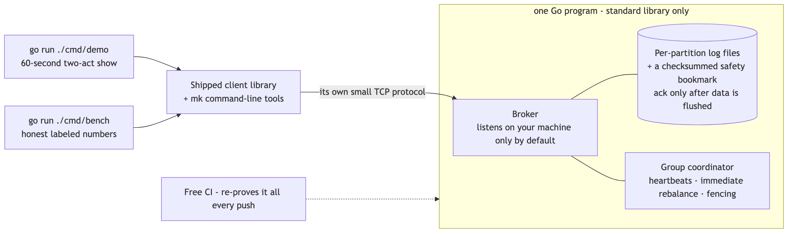
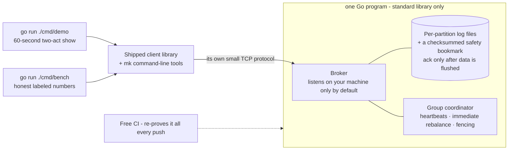
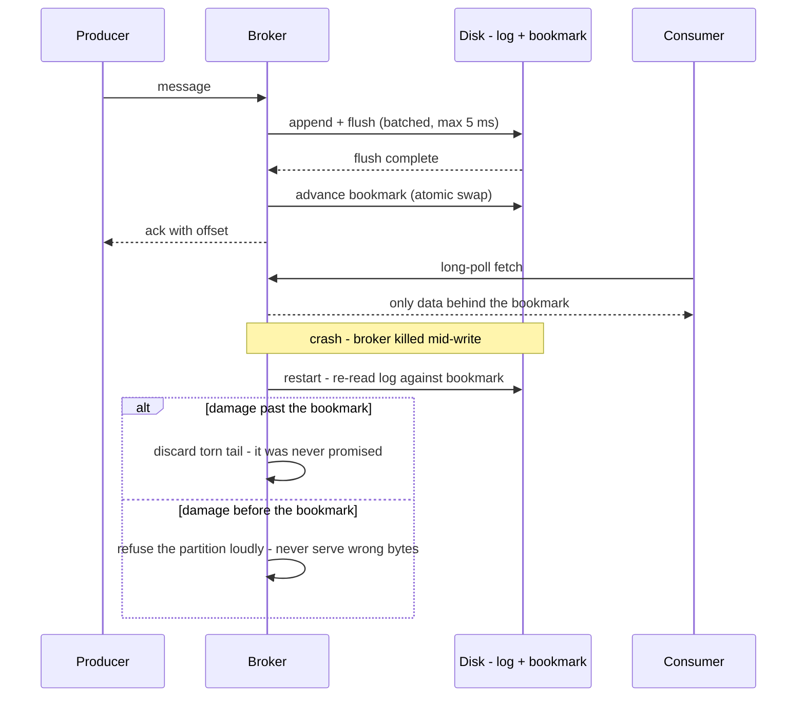

# DESIGN-BRIEF — mini-kafka · the only file you need to read at this gate

**For: DESIGN.md DRAFT v0.2 (2026-07-24), awaiting your verdict.** Built against your locked SPEC v1.0. Every answer is stated in full here; pointers are only for auditing.

## The shape, in one picture

Diagram source (mermaid — flowchart)

## The design in plain words

One Go program, zero outside dependencies, speaking its own small TCP protocol. Each partition is a plain append-only file plus a tiny checksummed "safety bookmark" that records how much of the file is truly flushed to disk — a message is acknowledged only after its bytes AND the bookmark are flushed, and **consumers are only ever shown data behind the bookmark**, so a crash can never un-happen something a reader already saw. Consumer groups heartbeat on a dedicated line, rebalance instantly when membership changes, and a stale consumer that wakes up late is fenced out by a generation number. The demo and benchmarks are just `go run` commands using the same shipped client, timed and labeled so honestly that CI fails if the numbers drift from what a real visitor would experience.

## The choices, by what they mean for you (say nothing = accept · full table: DESIGN §2–6)

| Choice | Effect on you |
|---|---|
| Every group member keeps a heartbeat line separate from its data line | A consumer quietly waiting for messages is never mistaken for dead — the review's biggest catch |
| Readers only ever see flushed data | Crash recovery is invisible to consumers: nothing they read can be rolled back |
| The safety bookmark is checksummed and atomically replaced | The one file recovery depends on cannot itself be half-written |
| Rebalance happens immediately, no waiting window | Worst-case takeover ≈ 3 seconds — the demo's act two stays snappy |
| The 60-second clock runs outside the demo, in a cold container | The published number includes compile time — what a real visitor actually pays — and CI fails if it exceeds 60 s |
| Demo and bench use a fresh temp folder each run | Running the demo twice just works |
| Benchmarks say "closed-loop" on the label and report GC pauses | Nobody can accuse the numbers of hiding the slow tail |
| After a disk error the broker refuses writes until restart | No clever self-healing to get wrong: reads keep working, restart re-verifies everything |
| The showcase is fronted by a free static "waking up…" page | Solves "how does a sleeping server show a loading screen" for $0 |

## Questions, answered (spot-check any)

1. **How do we KNOW an accepted message is on disk?** The ack is only sent after the flush and bookmark complete, the test suite has a recorder on the flush calls proving the order, and readers can't even see unflushed data. *(DD-4, DD-5, DD-6)*
2. **After a crash, what does the broker do with a damaged file?** Damage past the bookmark is discarded silently (that data was never promised); damage before the bookmark makes it refuse the partition loudly rather than serve wrong bytes — including the sneaky case where one record straddles the boundary, which Codex caught. *(DD-4)*
3. **Could a hostile topic name like `../../etc` do damage?** No — names are validated against a strict pattern before any file path is formed. *(DD-18)*
4. **What if two consumers both think they own a partition?** Every request carries a generation number checked at the moment it's served; the stale one gets an error and changes nothing. *(DD-12)*
5. **Is the hosted showcase still $0 and safe?** Yes — no-card evidence recorded, a written teardown rule if that ever changes, the broker port stays loopback-only, and a scripted port scan after each deploy proves only the web page answers. *(DD-23)*
6. **What's deliberately NOT built?** Runtime self-healing after disk errors, an open-loop benchmark mode (declined with a written reason — no capacity claims are made), segments/retention machinery, and any public Go API beyond the one client package.

## A message's journey — including the crash (the design's most dynamic behavior)

Diagram source (mermaid — sequence diagram)

## How this was checked

Four independent fresh-eyes reviewers, one cross-family (Codex): **37 findings, all integrated — one declined with a written reason.** The worst, plainly: all four seats independently found that the one-request-per-connection rule would starve heartbeats behind waiting fetches, getting every idle consumer declared dead every 2 seconds (the demo would have thrashed forever); the safety bookmark could itself be torn by a crash, and a corrupt record straddling its boundary would have been misclassified — silently deleting promised data; the demo's 60-second receipt was being measured from inside the program, blind to the compile time a real visitor pays; the protocol permitted a reply bigger than its own maximum legal message; and hostile topic names went straight into file paths.

## Status & what you do now

**Zero decisions are open at this gate** — every finding resolved into the design; the ledger locks by silence. Read this brief (~5 min). Reply **lock**, **revise: <what>**, or **abandon**. On "lock": 2–3 quiz questions from this brief first, then SLICES is next.
