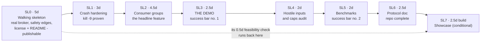

# SLICES-BRIEF — mini-kafka · the only file you need to read at this gate

**For: SLICES.md DRAFT v0.2 (2026-07-28), awaiting your verdict.** Built against your locked SPEC v1.0 and DESIGN v1.0. Every answer is stated in full here; pointers are only for auditing.

## The roadmap

Diagram source (mermaid — flowchart)

## The plan in plain words

Eight slices, built in order, each ending in something you can watch run — never "built a layer." Slice 0 is five days because it is the real thing in miniature: the actual broker binary, the durability spine, the safety edges (input limits, name checking, local-only listening), a license and truthful README so the repo can go public at your word, and CI running from day one. Then: crash-proofing, the consumer-groups centerpiece, the 60-second demo (your first success bar, ~15 days in), the hostile-input battery, the benchmarks (success bar two), the protocol document, and — only if the early free-tier check passed — the live showcase.

## What changed under review (effect on you)

| Change | Effect on you |
|---|---|
| Total went from 15.5 to 24.5 days | The old number was build-time-only fantasy — every sizing error pointed the same direction; the new one budgets the per-slice briefs, code maps, and gates you actually read |
| The broker moved INTO slice 0 | The reviewers caught that the "walking skeleton" had no broker in its build list — its own demo couldn't have run |
| Safety edges moved INTO slice 0 | Input limits and name validation now exist BEFORE the repo can go public, not three slices after |
| License + README moved INTO slice 0 | "Publish early" is now actually possible — v0.1 recommended publishing a legally all-rights-reserved repo |
| The demo moved ahead of the hostile-input work | You see success bar #1 sooner, and the demo stress-tests the groups machinery while it's fresh (Codex's call) |
| The free-tier check runs at slice 0's exit | You learn in week one whether the showcase can ever ship, not on day 20 |
| Half-proven promises are tracked | A check that spans two slices is marked at both ends and tracked in STATUS — no more "proven" on half the evidence |

## Questions, answered (spot-check any)

1. **Why should I believe 24.5 days when 15.5 was "command-summed" too?** The sum was honest; the addends weren't — the sizing seat re-priced each slice against what the locked design actually demands and found every error pointing under, so the fix was re-estimating, not averaging. *(SD-6)*
2. **What's the biggest slice and why?** Slice 0 at 5 days — it's the system's concurrency core plus the publishable-repo floor; pricing it small was how v0.1 hid its missing broker. *(SD-2)*
3. **When do I first see messages flow?** At slice 0's own exit demo (~week one): create topic, produce, consume, restart, consume again — over real TCP against the real binary. *(SL0)*
4. **When does the 60-second demo exist?** After SL3, roughly 15 days in. *(SD-4)*
5. **What happens if the free host fails its check?** You know at slice 0's exit; the showcase becomes a documented "later" and nothing else in the plan moves. *(SD-7)*
6. **How does the plan show consumer fencing actually working?** Scripted in slice 2's exit demo: one consumer is paused past its deadline, the survivor takes over, the paused one is resumed and its late commit is visibly rejected. *(SD-11 — v0.1's version claimed to show this with a killed process, which can't emit a late commit at all.)*

## How this was checked

Four independent fresh-eyes reviewers, one cross-family (Codex): **33 findings, all integrated.** The worst, plainly: the skeleton slice's build list contained no broker — the very first exit demo was unrunnable as written; a crash scenario was owned by a slice that couldn't demonstrate its commit half (commits didn't exist yet); the recommended "publish at slice 0" default pointed at a slice with no license in it; the sizing was uniformly optimistic by roughly a factor of 1.6; and the fencing demo claimed an observation a killed process cannot physically produce.

## Your two decisions at this gate (everything else locks by silence)

- **B1 — Publish when?** At slice 0's exit, iterating in public (recommended — matches your locked design's "public early", and an honest commit history is itself portfolio material) — or after SL3, once the 60-second demo works.
- **B2 — Which GitHub account?** Your existing one, or a new one (a new one would register under sr7544068@gmail.com per your standing rule). Only you can perform the publish step either way.

## What you do now

Read this brief (~5 min). Reply **lock** (with B1 + B2), **revise: <what>**, or **abandon**. On "lock": 2–3 quiz questions from this brief first — then the next invocation starts BUILD SL0.
