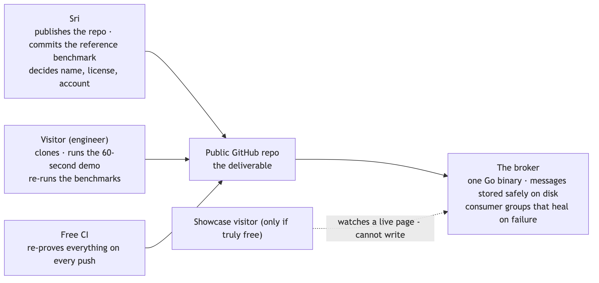
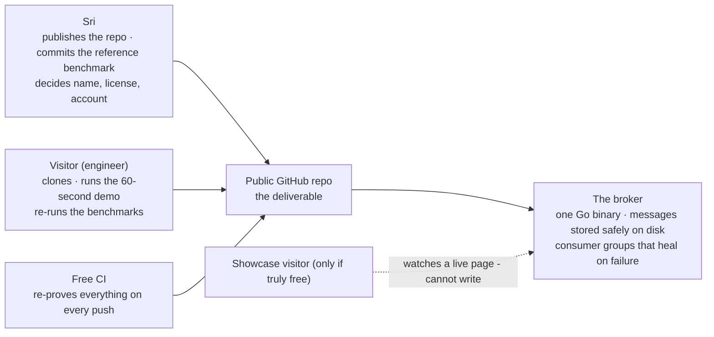
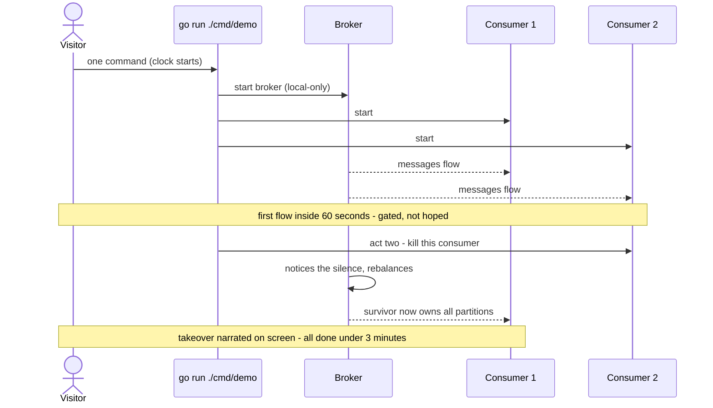

# SPEC-BRIEF — mini-kafka · the only file you need to read at this gate

**For: SPEC.md LOCKED v1.0 (2026-07-24).** This gate passed — this is the readable record. Every answer is stated in full here; pointers are only for auditing.

## Who's involved

Diagram source (mermaid — flowchart)

## What we're building, in plain words

A small Kafka-style message broker in Go, built to be read: one program that accepts messages, stores them durably on disk, and serves them to groups of consumers that automatically take over each other's work when one dies. The repo is the product — a visitor with only Go installed types one command and watches messages flow within 60 seconds, then watches a consumer get killed and the survivor take over. The benchmarks are deliberately honest: one durable mode, every number labeled and machine-written. Nothing needs a server; a small watch-only web showcase ships only if a genuinely free no-card tier exists.

## The choices, by what they mean for you (say nothing = accept · full table: SPEC §5)

| Choice | Effect on you |
|---|---|
| A message is only "accepted" after it's physically on disk | No fake speed — and the test watches the disk calls, because a plain crash test can't tell the difference |
| A replaced consumer is fenced out | A stalled consumer that wakes up late can't corrupt the group's progress |
| Visitors need only Go | The demo and benchmarks are `go run` commands — no make, no scripts, works the same on Mac and Linux |
| The broker only listens on your own machine by default | Nobody can reach it unless you explicitly flag it open |
| Disk full = polite refusal | New messages bounce with a clear error, reading still works, no repair step |
| No topic delete, no cleanup | Demo-scale decision: the data folder just grows; wipe it offline if needed |
| One honest benchmark mode | Numbers will be modest, but nobody can call them rigged |
| Repo goes public early | The repo itself is the deliverable — CI, license, README are requirements, not chores |

The other 11 ledger rows are mechanical (protocol shape, offset conventions, and similar); they're in SPEC §5 and silence accepts them.

## Questions, answered (spot-check any)

1. **Can an accepted message ever vanish in a crash?** No — the ack is only sent after the disk write is truly flushed, and the review forced a proof that watches the flush calls directly, because the naive kill-test passes even on a broken broker. *(LOG-1, §1b)*
2. **Can a half-dead consumer wreck things after being replaced?** No — its next action is rejected as stale, so it can't move the group's position at all. *(GRP-5)*
3. **What can go wrong on a visitor's machine?** Almost nothing external: only Go is needed, the clock for "60 seconds" starts at their command (not their download speed), and an over-60s run fails our own gate. *(DEMO-1)*
4. **What happens when the disk fills?** Producers get a clear "write failed" error, consumers keep reading, and freeing space is the whole fix. *(LOG-5, Scenario J)*
5. **Could the showcase quietly cost money?** No — it ships only on a free tier with no card on the account (I removed the "hard cap" loophole, which contradicted your grill answer), and it tears down rather than pays. *(SHOW-2)*
6. **What's the catch on that free showcase?** It sleeps when idle — a visitor's first load waits about a minute behind a loading screen, and its data resets on restart. That's the accepted price of $0. *(R6, SHOW-1)*
7. **If the broker's data files get damaged, does it lie?** No — damaged unacknowledged tail data is discarded (it was never promised), but damage to promised data makes the broker refuse loudly rather than serve wrong bytes. *(LOG-4)*

## The demo, as a sequence (the thing a visitor actually experiences)

Diagram source (mermaid — sequence diagram)

## How this was checked

Five independent fresh-eyes reviewers — four Claude seats plus Codex (different AI family): **46 findings, all integrated or escalated to you.** The worst, plainly: the spec's original durability test was worthless (a killed process's data survives in the operating system's memory anyway, so the test passed even with safety off); four seats independently found the half-dead-consumer hole; the hosted showcase as first written would have filled its own disk and died; the repo had no license, which legally means "all rights reserved" — the opposite of a portfolio; and a subtle off-by-one in how "resume position" was defined could have shipped two incompatible interpretations that tests would never catch.

## Your four decisions at this gate (resolved at lock, 2026-07-24)

1. **Public name — "mini-kafka" stays** (your call, trademark note acknowledged).
2. **License — MIT.**
3. **Benchmark modes — durable-only.**
4. **Showcase — kept conditional** against the free tier's realities (sleeps, ~1-min wake, data resets).
Also standing: a new GitHub account would use your designated registration email; you chose your existing account.

## Status

LOCKED 2026-07-24 after the 3-question quiz (two re-asks, both then answered on this brief's exact lines) and your four decisions above. Next stage: DESIGN — starts when you invoke it.
