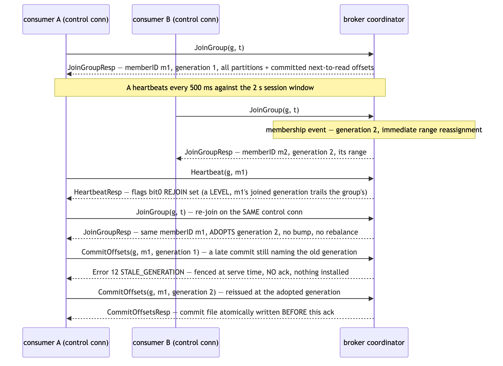
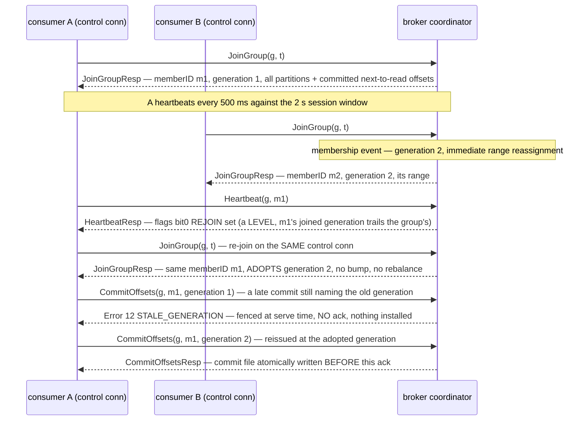

# mini-kafka wire protocol (version 1)

This document is the complete wire contract of the mini-kafka broker, written
so that a stranger can implement a client from it alone — no reading of the
broker source required. It documents the AS-BUILT protocol: every behavioral
claim below is written against a named source location, and the two registry
tables (§4 message types, §6 error codes) are machine-diffed against
`internal/wire`'s own source by `internal/wire/protocoldoc_test.go` on every
test run, in both directions — a type or code added, removed, renamed, or
renumbered without its doc row is a build failure.

Sections marked **normative** bind any client implementation; notes marked
*informative* describe what the shipped client (`client/`) happens to do and
carry no obligation.

## 1. Overview

- **Version 1 is the only protocol version.** Every frame carries a version
  byte and its only legal value is 1 (`wire.Version`, `internal/wire/frame.go`);
  any other value is rejected as MALFORMED and the connection is closed.
- **Registries are add-only and never renumbered.** The message-type values
  (§4) and error-code values (§6) are pinned; future revisions may append new
  values but existing ones never change meaning (pinned in
  `internal/wire/frame.go` and `internal/wire/errors.go`).
- **Single broker, plain TCP.** There is no cluster, no TLS, and no
  authentication (§13); a client opens an ordinary TCP connection (default
  `127.0.0.1:7621`) and starts writing frames. There is no handshake or hello
  message.
- **Big-endian throughout.** Every multi-byte integer on the wire is
  big-endian (§3).
- One request is in flight per connection at a time: write a request frame,
  then read frames until its answer arrives (§4 read loop, §7 lifecycle).

## 2. Frame envelope

Every message in either direction travels in the same envelope
(`internal/wire/frame.go`, `WriteFrame`/`ReadFrame`):

```text
byte offset   0            4          5          6                4 + len
              +------------+----------+----------+------------------+
              | u32 len    | u8 ver=1 | u8 type  | payload          |
              | big-endian |          |          | (len - 2 bytes)  |
              +------------+----------+----------+------------------+
                           ^~~~~~~~~~ len covers this ~~~~~~~~~~~~~~^
```

- `len` counts everything AFTER itself: the version byte, the type byte, and
  the payload — so `len = 2 + payload length`, and the total on-the-wire
  frame is `4 + len` bytes.
- `ver` must be 1. `type` is a registry value from §4. `payload` is the
  message body, encoded per §5 with the primitives of §3.

**Frame caps (normative).** Caps bound the TOTAL on-the-wire size including
the 4-byte length prefix, and they are asymmetric so a maximum-`maxBytes`
fetch response stays legal (`internal/wire/frame.go`):

- requests (client → broker): `wire.MaxRequestFrame` = 1 MiB + 4 KiB
  (1,052,672 bytes total);
- responses (broker → client): `wire.MaxResponseFrame` = 4 MiB + 64 KiB
  (4,259,840 bytes total). A client's frame reader must accept responses up
  to this cap.

**Envelope errors** (`ReadFrame`, `internal/wire/frame.go`):

- `len < 2` (the body cannot even hold ver + type) → Error frame,
  MALFORMED.
- Oversized frame (`4 + len` over the reader's cap) → Error frame,
  FRAME_TOO_LARGE — checked BEFORE any payload allocation, so a hostile
  length cannot drive memory use.
- `ver != 1` → Error frame, MALFORMED.
- A connection cut mid-frame (header arrived, body did not) is an I/O
  condition, not a protocol error: no Error frame exists for it, the reader
  just sees unexpected EOF.

What the broker does with the connection after each of these is §7.

## 3. Encoding primitives

Message bodies are built from exactly four primitives
(`internal/wire/frame.go`):

| primitive | wire form |
|---|---|
| `u8`, `u16`, `u32`, `u64` | unsigned big-endian integer, 1/2/4/8 bytes |
| `str` | `[u16 n][n bytes]` — length-prefixed bytes, no terminator, no required encoding |
| `blob` | `[u32 n][n bytes]` — length-prefixed bytes |

**Strict decode (normative).** The broker decodes bodies strictly, and a
conforming client should too:

- a body that ends before a declared length is satisfied → MALFORMED
  (`truncated message body`);
- a hostile length can never allocate past the frame it arrived in — every
  length is checked against the bytes actually present, which the frame cap
  already bounds;
- bytes left over after the last field of a body → MALFORMED
  (`trailing bytes after message body`). Do not append padding.

## 4. Message-type registry

The table below is the COMPLETE message set — it is diffed against the
package-wide `Type*` constants of `internal/wire` (all `.go` files, values
contiguous 1..17 plus 255), so it cannot silently gain or lose a row.

**The read loop (normative).** Every request is answered by exactly one
frame: its paired `response` type from the table, OR an Error frame
(type 255) carrying a §6 code. A client must therefore read the type byte
FIRST and branch on 255 before matching the expected response type
(`internal/broker/server.go` error path). Note the one asymmetric pairing:
GroupFetch (17) is answered by FetchResp (4) — no "GroupFetchResp" exists
(`internal/wire/messages.go`).

<!-- registry:types:begin -->
<!-- grammar: between these markers the only legal lines are blanks, this comment, ONE header row, ONE separator row, and data rows whose first cell is a base-10 integer; cells split on unescaped pipes only (a backslash-pipe is a literal pipe); row count must equal the registry cardinality -->

| type | name | direction | response | body summary |
|---|---|---|---|---|
| 1 | Produce | request | ProduceResp | [str topic][u32 partition][blob payload] |
| 2 | ProduceResp | response | — | [u64 offset] — the ack, sent only after the record is durable |
| 3 | Fetch | request | FetchResp | [str topic][u32 n]{[u32 partition][u64 offset]}[u32 maxWaitMs][u32 maxBytes] |
| 4 | FetchResp | response | — | [u32 n]{[u32 partition][u32 nRecs]{[u64 offset][blob payload]}} — zero-record groups are legal |
| 5 | CreateTopic | request | CreateTopicResp | [str topic][u32 partitions] |
| 6 | CreateTopicResp | response | — | empty body |
| 7 | ListTopics | request | ListTopicsResp | empty body — a non-empty body is MALFORMED |
| 8 | ListTopicsResp | response | — | [u32 n]{[str name][u32 partitions]} |
| 9 | JoinGroup | request | JoinGroupResp | [str group][str topic] — one topic per group |
| 10 | JoinGroupResp | response | — | [str memberID][u64 generation][u32 n]{[u32 partition][u64 nextOffset]} — join carries the resume state |
| 11 | Heartbeat | request | HeartbeatResp | [str group][str memberID][u64 generation] |
| 12 | HeartbeatResp | response | — | [u8 flags] — bit0 is the level-triggered REJOIN signal |
| 13 | CommitOffsets | request | CommitOffsetsResp | [str group][str memberID][u64 generation][u32 n]{[u32 partition][u64 next]} — next-to-read positions |
| 14 | CommitOffsetsResp | response | — | empty body — the ack means the commit is durable |
| 15 | LeaveGroup | request | LeaveGroupResp | [str group][str memberID] |
| 16 | LeaveGroupResp | response | — | empty body |
| 17 | GroupFetch | request | FetchResp | [str group][str memberID][u64 generation] plus Fetch's exact entry/maxWait/maxBytes tail — answered by FetchResp, type 4 |
| 255 | Error | response | — | [u16 code][str msg] — code from the §6 registry, msg is diagnostic text |

<!-- registry:types:end -->

## 5. Message reference

**Name rule (normative).** Every topic and group name must match
`^[a-z0-9][a-z0-9._-]{0,127}$` (`internal/wire/names.go`): it starts with a
lowercase letter or digit, uses only lowercase letters, digits, `.`, `_`,
`-`, and is at most 128 bytes. Any request naming a topic or group outside
the rule is answered with INVALID_NAME before anything else happens — the
rule is enforced in the protocol layer, so path traversal is structurally
impossible downstream.

Field tables give each body's fields in wire order. Encodings are §3
primitives; braces `{...}` mark a group repeated by the count immediately
before it. Source of truth: `internal/wire/messages.go`.

### Produce (type 1)

| field | wire form | meaning |
|---|---|---|
| topic | str | target topic, name rule applies |
| partition | u32 | target partition, `0 ≤ partition <` the topic's count |
| payload | blob | the record; at most 1 MiB (§10), rejected BEFORE anything is written |

Answered by ProduceResp only after the record is written, fsynced, and
covered by the durable frontier (§11).

### ProduceResp (type 2)

| field | wire form | meaning |
|---|---|---|
| offset | u64 | the assigned offset — a contiguous ordinal per partition, starting at 0 |

### Fetch (type 3)

| field | wire form | meaning |
|---|---|---|
| topic | str | topic to read, name rule applies |
| nEntries | u32 | number of entries following; 1..16 (§8) |
| entries | {u32 partition, u64 offset} × nEntries | each entry names a partition and the first offset wanted |
| maxWaitMs | u32 | long-poll bound in milliseconds; 0 means the 5 s default, cap 30,000 (§8) |
| maxBytes | u32 | response budget in bytes; 0 means the 1 MiB default, cap 4 MiB (§8) |

Validation order, defaults, the budget accounting formula, and the parking
rules are §8.

*Informative:* the multi-entry form (2..16 entries) is a fully supported
protocol shape with no shipped-client caller — the shipped client only
issues single-entry raw Fetches, while GroupFetch (type 17) exercises the
same multi-entry tail. Implement it; nothing about it is vestigial.

### FetchResp (type 4)

| field | wire form | meaning |
|---|---|---|
| nGroups | u32 | number of per-partition groups following |
| groups | {u32 partition, u32 nRecs, {u64 offset, blob payload} × nRecs} × nGroups | records per partition, in the request's entry order |

A group with `nRecs = 0` is legal — it is the empty-at-timeout shape (§8)
and the "budget spent by earlier entries" shape. Offsets within a group
ascend; a response never carries records past the durable frontier (§11).

### CreateTopic (type 5)

| field | wire form | meaning |
|---|---|---|
| topic | str | new topic's name, name rule applies |
| partitions | u32 | partition count, 1..16 (§10) |

The partition count is fixed at creation: this message set contains
no resize operation (§13).

### CreateTopicResp (type 6)

Empty body.

### ListTopics (type 7)

Empty body — a ListTopics with a non-empty body is answered MALFORMED
(`internal/broker/handlers.go`).

### ListTopicsResp (type 8)

| field | wire form | meaning |
|---|---|---|
| n | u32 | number of topics |
| topics | {str name, u32 partitions} × n | every existing topic and its partition count |

### JoinGroup (type 9)

| field | wire form | meaning |
|---|---|---|
| group | str | group to join (created on first join), name rule applies |
| topic | str | the topic this group consumes — ONE topic per group |

Joining an existing group while naming a different topic is MALFORMED
(`internal/group/coordinator.go`). Joining an unknown topic is
UNKNOWN_TOPIC before any group state changes. Group-membership behavior —
generations, assignment, re-join semantics — is §9.

### JoinGroupResp (type 10)

| field | wire form | meaning |
|---|---|---|
| memberID | str | broker-minted member identity, unique per broker lifetime |
| generation | u64 | the group generation this join is valid for |
| n | u32 | number of assigned partitions |
| assigned | {u32 partition, u64 nextOffset} × n | owned partitions plus the committed next-to-read offset to resume from |

The join response carries the WHOLE resume state — there is no separate
offset-fetch round (`internal/wire/messages.go`, DD-14).

### Heartbeat (type 11)

| field | wire form | meaning |
|---|---|---|
| group | str | the member's group |
| memberID | str | the member's identity from JoinGroupResp |
| generation | u64 | carried but deliberately NOT fenced (§9) — only an unknown member errors a heartbeat |

### HeartbeatResp (type 12)

| field | wire form | meaning |
|---|---|---|
| flags | u8 | bit0 = REJOIN, a LEVEL: set while the member's joined generation trails the group's; the member must re-JoinGroup (§9) |

### CommitOffsets (type 13)

| field | wire form | meaning |
|---|---|---|
| group | str | the member's group |
| memberID | str | the committing member |
| generation | u64 | fenced at serve time (§9) |
| n | u32 | number of entries |
| entries | {u32 partition, u64 next} × n | per partition, the NEXT offset to read — not the last one processed |

Committed positions are next-to-read. Committing a partition outside the
member's current assignment is STALE_GENERATION (§9).

### CommitOffsetsResp (type 14)

Empty body. The ack is sent only AFTER the commit file's atomic write —
an acked commit survives a crash (§9, §11).

### LeaveGroup (type 15)

| field | wire form | meaning |
|---|---|---|
| group | str | the group to leave |
| memberID | str | the leaving member |

A voluntary leave is a membership event: generation bump and immediate
reassignment for the remaining members (§9).

### LeaveGroupResp (type 16)

Empty body.

### GroupFetch (type 17)

| field | wire form | meaning |
|---|---|---|
| group | str | the member's group — the topic is implied by the group's binding, there is no topic field |
| memberID | str | the fetching member |
| generation | u64 | fenced at serve time, including on wake from a park (§9) |
| nEntries | u32 | as Fetch — 1..16 entries |
| entries | {u32 partition, u64 offset} × nEntries | as Fetch |
| maxWaitMs | u32 | as Fetch |
| maxBytes | u32 | as Fetch |

GroupFetch is answered by FetchResp (type 4) — the response shape is
identical to a plain Fetch's and there is no GroupFetchResp. Fetch
validation and parking (§8) apply unchanged; the group fence (§9) runs
before every serve attempt.

**Why GroupFetch exists:** group fetches must carry memberID and generation
for serve-time fencing — the plain Fetch shape has no such fields — and the
topic is implied by the group's binding, so GroupFetch carries no topic
field (`internal/wire/messages.go`, `internal/broker/handlers.go`). This
message superseded the original design's prose picture of group reads over
plain Fetch; that divergence was surfaced and accepted at the SL2 gate
(D-SL2-2).

### Error (type 255)

| field | wire form | meaning |
|---|---|---|
| code | u16 | a value from the §6 registry |
| msg | str | human-readable diagnostic; its exact text is NOT part of the contract — branch on `code`, never parse `msg` |

## 6. Error-code registry

The table below is the COMPLETE code set — it is diffed three ways against
`internal/wire/errors.go`'s const block and `wire.AllCodes()`, so it cannot
silently gain or lose a row. (This registry has 13 codes; the original
design prose listed 12 — the divergence was surfaced and accepted at the
SL4 gate, D-SL4-6.)

Whether the connection survives after an Error frame depends on the code's
class — see §7.

<!-- registry:codes:begin -->
<!-- grammar: between these markers the only legal lines are blanks, this comment, ONE header row, ONE separator row, and data rows whose first cell is a base-10 integer; cells split on unescaped pipes only (a backslash-pipe is a literal pipe); row count must equal the registry cardinality -->

| code | name | meaning | when sent |
|---|---|---|---|
| 1 | UNKNOWN_TOPIC | the named topic does not exist | Produce, Fetch, or JoinGroup naming a topic the broker does not have |
| 2 | TOPIC_EXISTS | the topic already exists | CreateTopic on a name already present |
| 3 | BAD_PARTITION | partition index out of range | Produce or Fetch naming a partition at or past the topic's partition count |
| 4 | INVALID_NAME | the name fails the §5 name rule | any request whose topic or group name violates the pinned regex, before anything else happens |
| 5 | MSG_TOO_LARGE | produce payload over the 1 MiB cap | Produce with a payload over broker.MaxPayload, rejected BEFORE anything touches storage |
| 6 | FRAME_TOO_LARGE | the frame exceeds the reader's total-size cap | a request frame over the §10 request cap, detected from the length prefix BEFORE any allocation; the connection is closed after the Error frame (§7) |
| 7 | MALFORMED | the frame or body does not parse, or a structural rule is broken | short frame length, unsupported version, truncated or oversized body fields, trailing bytes, unknown message type, zero fetch entries, ListTopics with a body, JoinGroup naming a different topic than the group's binding, unreadable group commit state |
| 8 | CAP_EXCEEDED | a numeric cap was exceeded | maxWaitMs or maxBytes over their §10 caps, topic or partition-count caps, group or member caps, and — unsolicited (§7) — the connection cap |
| 9 | FETCH_TOO_WIDE | too many fetch entries | Fetch or GroupFetch with more than 16 entries |
| 10 | SHUTTING_DOWN | the broker is draining | every request while a graceful stop is in progress; parked fetches instead return the empty shape (§7) |
| 11 | WRITE_FAILED | persistence failed, nothing was acked | append or fsync failure (the partition then rejects writes until restart), a group commit-file write failure, or an internal storage error — an Error with this code means NO ack was sent |
| 12 | STALE_GENERATION | live member, stale generation | GroupFetch or CommitOffsets carrying an outdated generation, or a commit naming partitions outside the member's assignment (§9) |
| 13 | UNKNOWN_MEMBER | the member identity is gone | group unknown, or memberID not in the live set — a swept or disconnected member's later requests land here (§9) |

<!-- registry:codes:end -->

## 7. Connection lifecycle

**One request in flight per connection.** The broker serves a connection
sequentially: read one frame, dispatch, write the answer, read the next
(`internal/broker/server.go`, the frame loop). There is no pipelining — a
second request written early just waits in the socket until the first
answer is written.

**Idle reclaim is SILENT.** A connection that completes no request for
5 minutes (`broker.DefaultIdleTimeout`) is closed with no farewell frame —
the peer is presumed absent, and a goodbye to an absent peer can stall. The
idle clock is re-armed at the top of every frame read; a legal fetch park
(§8) happens after the frame arrived and does not trip it.

**Error-then-CLOSE class.** After these Error frames the broker drops the
connection, because the byte stream is no longer trustworthy or the request
is unroutable:

- FRAME_TOO_LARGE (oversized frame) and MALFORMED for a short length or a
  bad version — envelope damage (§2);
- MALFORMED for an unknown message type.

**Error-then-CONTINUE class.** A malformed BODY and every semantic
rejection — INVALID_NAME, UNKNOWN_TOPIC, BAD_PARTITION, TOPIC_EXISTS,
MSG_TOO_LARGE, FETCH_TOO_WIDE, CAP_EXCEEDED on a request field, the group
fences 12/13 — answer with an Error frame and the connection stays usable
for the next request.

**CAP_EXCEEDED at the connection cap is UNSOLICITED.** When the broker is
at its connection cap (§10), an accepted connection is written a
CAP_EXCEEDED Error frame immediately on accept — before any request is
sent — under a write deadline of about 1 s, and closed; the connection
never enters the broker's table. A client that connects but does not read
promptly can therefore miss the frame entirely and observe only EOF: treat
an early EOF on a fresh connection as possible cap rejection.

**Graceful-stop drain (SHUTTING_DOWN).** While the broker drains, every
new request is answered with SHUTTING_DOWN (code 10); fetches already
parked are released with the empty-at-timeout shape (§8), not an error.
Connections are closed once in-flight responses are written.

## 8. Fetch and long-poll

Everything here applies to Fetch (type 3) and GroupFetch (type 17) alike;
GroupFetch additionally runs the §9 fence before every serve attempt.

**Validation order (as coded, `internal/broker/handlers.go`).** Checks run
in this order and the first failure answers the whole frame — nothing is
served partially:

1. body decode → MALFORMED;
2. name rule → INVALID_NAME;
3. zero entries → MALFORMED (`fetch requires at least one entry`);
4. more than 16 entries → FETCH_TOO_WIDE;
5. `maxWaitMs > 30000` → CAP_EXCEEDED;
6. `maxBytes > 4 MiB` → CAP_EXCEEDED;
7. entry resolution → UNKNOWN_TOPIC / BAD_PARTITION (any bad entry fails
   the whole frame).

Defaults applied after validation: `maxWaitMs = 0` means 5,000 ms;
`maxBytes = 0` means 1 MiB.

**Budget accounting (normative interop contract).** Records are served
across the request's entries in request order against ONE shared `maxBytes`
budget, and each record costs exactly `12 + len(payload)` budget bytes —
the u64 offset (8 bytes) plus the u32 payload-length prefix (4 bytes) of
its FetchResp encoding. Two implementations accounting differently would
diverge on which records fit; this formula is the contract.

**Min-one is per-RESPONSE.** Only the FIRST record served across all
entries in request order may exceed `maxBytes` — so a single oversized
record cannot wedge a consumer forever. After that first record the budget
is strict, which keeps the total under the response frame cap (§2).

**Long-poll parking.** If no requested entry has data at or after its
offset, the broker parks the fetch until data arrives anywhere in the
request, the `maxWait` timer fires, or the broker stops. A wake re-serves
with a full budget (GroupFetch re-fences first, §9).

**Empty-at-timeout shape (pinned).** A fetch that times out — or is caught
by a broker stop — returns a FetchResp with exactly one zero-record group
per requested entry, in request order. At-tail is a normal answer, not an
error.

**Read-deadline rule (normative).** A client's read timeout for a fetch
response MUST exceed the `maxWaitMs` it requested. The broker legally parks
the response for up to `maxWait` (≤ 30 s) and arms its own write deadline
only AFTER dispatch — it will never write early. A client with a fixed 5 s
read timeout long-polling with `maxWaitMs = 30000` kills its connection on
every empty poll.

## 9. Consumer groups

**The control connection IS liveness.** The connection a member joined on
is its control connection; the broker binds the membership to it. Dropping
it is IMMEDIATE member death — generation bump and rebalance — not a
wait-for-timeout (`internal/broker/server.go` teardown,
`internal/group/coordinator.go` ConnClosed).

**Timing.** The broker sweeps membership every 100 ms and declares a member
dead after 2 s without liveness evidence (heartbeat or in-flight commit);
the intended client cadence is a heartbeat every 500 ms
(`internal/group/coordinator.go` defaults; the obligation is restated in
§12).

**Generations and range assignment.** Every membership event — join,
leave, death — bumps the group generation and IMMEDIATELY re-assigns the
topic's partitions as contiguous ranges over the sorted member IDs. There
is no join window: each event rebalances at once.

**Join carries state.** JoinGroupResp returns the member's identity,
the current generation, and its assignment WITH the committed next-to-read
offset per partition — the whole resume state in one round; there is no
separate offset-fetch message.

**REJOIN is a LEVEL, not an event.** HeartbeatResp flags bit0 is set WHILE
the member's joined generation trails the group's, on every heartbeat until
the member re-joins. The required response is a new JoinGroup on the SAME
control connection.

**Heartbeats are EXEMPT from the generation fence.** A heartbeat carrying a
stale generation still refreshes liveness and gets a normal HeartbeatResp
(with REJOIN set); only an unknown member errors (13). Fencing heartbeats
would make REJOIN undeliverable and falsely sweep live members
mid-rebalance.

**Serve-time fencing, pinned precedence.** GroupFetch and CommitOffsets
are fenced at serve time against the member's liveness and generation, and
the precedence is pinned: UNKNOWN_MEMBER (13) before STALE_GENERATION (12)
— not-live always wins (`internal/group/coordinator.go`).

**The 12-vs-13 split (normative — a client implements these DIFFERENTLY):**

- **13 UNKNOWN_MEMBER — the identity is gone** (swept, disconnected, or
  never known). Recover with a fresh JoinGroup: the broker mints a NEW
  memberID, bumps the generation, and rebalances the whole group.
- **12 STALE_GENERATION — the member is live but its generation is
  outdated.** Recover with a re-JoinGroup on the SAME control connection:
  the broker returns the SAME memberID and the member ADOPTS the current
  generation — NO bump, no group-wide disturbance — then reissue the
  fenced request.
- Either code on a fetch means re-join then reissue. Neither is fatal.

**A parked GroupFetch during a rebalance is race-dependent — documented as
such.** If data arrives while the group rebalances under a parked
GroupFetch, the wake re-fences and the fetch returns 12; if the park
instead ends by timeout or broker stop, it returns the empty-at-timeout
shape WITHOUT re-fencing. The same rebalance can therefore surface as
either answer; a client must handle both (re-join on 12, notice REJOIN via
heartbeat after an empty poll).

**Commits.** A CommitOffsets is processed as: fence (13 before 12) → merge
the entries onto the group's CURRENT committed map → atomic write of the
group's commit file BEFORE the ack → re-fence at install (a member fenced
mid-write gets 12/13 and NO ack, and nothing is installed). Committing any
partition outside the member's current assignment is STALE_GENERATION.
Positions are next-to-read (§5, CommitOffsets).

**The lifecycle in one picture** — join, assignment, heartbeat/REJOIN,
re-join adopting the generation, and a fenced late commit:



<details><summary>Diagram source (mermaid — sequence diagram)</summary>



</details>

## 10. Limits

Every cap, its owning Go constant, and the code a violation earns. This
table is NOT machine-diffed (ledger row 5) — each row cites its constant by
name so auditing a row is one grep; the values themselves are pinned
behaviorally by per-cap rejection tests.

| Go constant | value | what it caps | on violation |
|---|---|---|---|
| `wire.MaxRequestFrame` | 1 MiB + 4 KiB | total on-the-wire request frame, prefix included | FRAME_TOO_LARGE |
| `wire.MaxResponseFrame` | 4 MiB + 64 KiB | total on-the-wire response frame, prefix included | FRAME_TOO_LARGE |
| `broker.MaxPayload` | 1 MiB | one produce payload | MSG_TOO_LARGE |
| `broker.MaxFetchWaitMs` | 30,000 | fetch maxWaitMs | CAP_EXCEEDED |
| `broker.MaxFetchBytes` | 4 MiB | fetch maxBytes | CAP_EXCEEDED |
| `broker.MaxFetchEntries` | 16 | entries per Fetch/GroupFetch | FETCH_TOO_WIDE |
| `wire.nameRE` (names.go) | 128 bytes | topic/group name length and alphabet | INVALID_NAME |
| `storage.MaxTopics` | 64 | live topics | CAP_EXCEEDED |
| `storage.MaxPartitionsPerTopic` | 16 | partitions per topic at creation | CAP_EXCEEDED |
| `group.MaxGroups` | 64 | live consumer groups | CAP_EXCEEDED |
| `group.MaxMembersPerGroup` | 32 | members per group | CAP_EXCEEDED |
| `broker.DefaultMaxConns` | 256 | concurrent connections | CAP_EXCEEDED, unsolicited (§7) |

Defaults (not caps): fetch `maxWaitMs = 0` means 5,000 ms
(`broker.DefaultFetchWait`); fetch `maxBytes = 0` means 1 MiB
(`broker.DefaultFetchBytes`).

## 11. Durability semantics

**What a produce ack means.** ProduceResp is sent only after the record is
appended to the partition's log, fsynced, and covered by the durable
frontier's own atomic write — append → fsync → frontier → ack
(`internal/storage/partition.go`). An acked record survives a crash.

**Reads are capped at the durable frontier.** No fetch response ever
carries a record that is not fsync-covered — a consumer cannot observe
data that a crash could take back, so there are no phantom reads to
handle.

**Group-commit window.** The broker batches appends per partition in a
5 ms window (`flushWindow`, `internal/storage/partition.go`), fsyncing a
batch at a time; produce-ack latency floors at that window.

**Commit acks.** A CommitOffsetsResp likewise means the group's commit
file was atomically written first (§9) — an acked commit survives a crash,
and a rejoining member resumes from exactly the committed next-to-read
positions.

**Delivery is at-least-once.** Duplicates are possible — a crash after
append but before the ack, or a rebalance between processing and commit,
re-delivers records. Loss of acked data is not. Consumers must be
idempotent or deduplicate by (partition, offset).

**Platform caveat** (this sentence is quoted verbatim from
`cmd/bench/report.go`, the single wording authority — the README carries
the same sentence):
"durability is platform-qualified: on macOS Go's Sync is F_FULLFSYNC (drive-cache barrier — stronger and slower); on Linux plain fsync (DD-7, corrected)".

## 12. Normative client obligations vs informative notes

The broker enforces the normative list below by LIVENESS and FENCING, not
by protocol errors naming the violation — a client that heartbeats too
slowly is swept, not lectured. "Works with my client" is not conformance;
these are:

- **Heartbeat cadence:** send a Heartbeat at most every 500 ms per member
  against the 2 s session window (§9). Slower cadences race the sweeper.
- **Re-JoinGroup on REJOIN:** the HeartbeatResp bit0 level (§9) obligates a
  re-join on the same control connection; ignoring it strands the member on
  a stale generation.
- **The 12-vs-13 split, implemented differently:** 13 → fresh join (new
  identity, group-wide rebalance); 12 → re-join adopting the current
  generation, then reissue; either on a fetch = re-join + reissue, never
  fatal (§9).
- **The read-deadline rule:** a fetch read timeout MUST exceed the
  requested maxWaitMs (§8).

*Informative* — the shipped client's choices, carrying no obligation: its
Producer and Consumer never auto-reconnect (an idle-reclaimed connection
surfaces EOF/reset and the caller redials); its GroupConsumer's heartbeat
goroutine only RECORDS a rejoin-needed condition and Poll re-joins lazily,
redialing its fetch connection after idle reclaim.

## 13. What this protocol does NOT have

- **No partition resize.** Partition count is fixed at creation; this
  message set contains no resize operation. (Machine-checked: the §4 table
  is diffed against the implemented set, and the diff test additionally
  rejects any documented type name matching the resize family.)
- **No topic delete.** Topics, once created, exist for the broker's
  lifetime; there is no delete or retention message.
- **No auth, no TLS.** Plain TCP. The broker binds loopback by default;
  exposing the port exposes an unauthenticated protocol.
- **No Kafka compatibility.** The concepts are Kafka-style; the wire format
  is NOT Kafka's and no Kafka client can speak it.
- **No version negotiation.** Version 1 is the only version; message types
  and error codes are add-only and never renumbered (§1).
