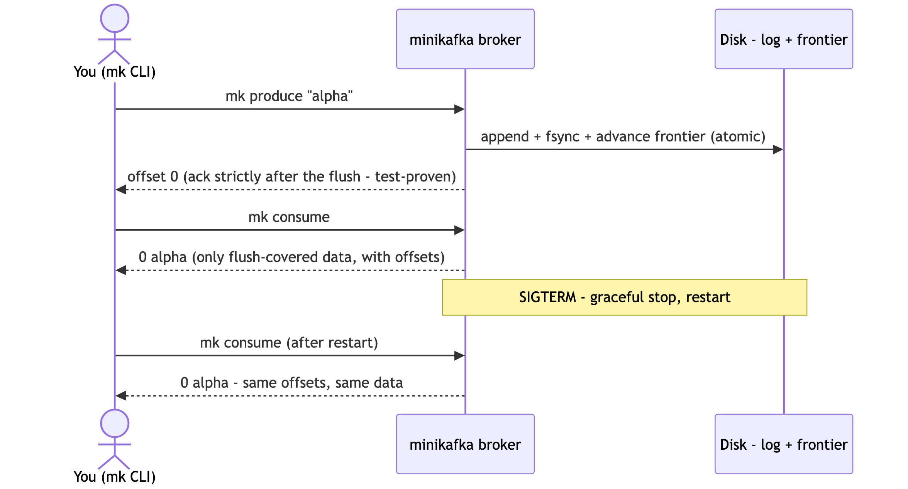
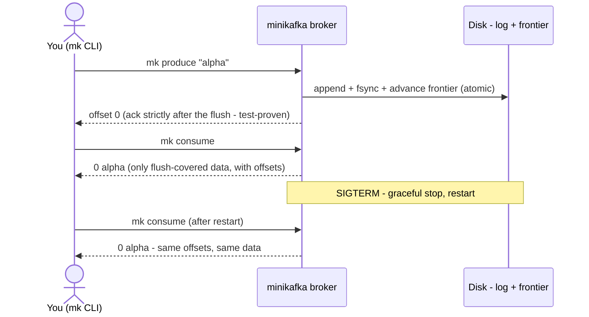

# SL0 BRIEF — Walking skeleton · what got built and proven

**For: slice SL0, at your gate (2026-07-28).** Read this, not the slice's DESIGN/PLAN. Everything below is receipted, not asserted.

## What exists now (the spine, working)

Diagram source (mermaid — sequence diagram)

A real broker binary and a real CLI, speaking their own binary protocol over TCP. Messages land in per-partition append-only files; a produce is acknowledged only after its bytes AND the "safety bookmark" (durable frontier) are flushed; consumers are only ever served flushed data. Topics are created explicitly, names are validated before touching any path, every live input has a cap with its own error code, the broker listens on your machine only by default, and it shuts down cleanly on Ctrl-C. LICENSE (MIT) and a truthful README are in place; the CI workflow and its full local equivalent (`scripts/checks.sh`) are green.

## The proofs (all from commands, receipts committed)

- **51 tests, 51 pass** (`go test ./... -count=1`, storage/broker/client also race-checked). `vet`, `gofmt`, stdlib-audit, Linux cross-build: clean.
- **Red-before-green for every test file** — `docs/receipts/sl0-red-green.txt` (216 lines of captured red and green runs).
- **The headline invariant sabotaged and caught:** I made the broker ack before flushing — the ordering test failed exactly as designed; restored, green again.
- **Scenario B live** — `docs/receipts/sl0-scenario-b.txt`: produce four, consume with visible offsets, graceful stop, restart, identical offsets and payloads.
- **Showcase feasibility check (run early per plan): PASS** — `docs/receipts/showcase-feasibility.md`. Render's free tier fits (750 free hours/month vs 720 needed even always-on); the only unsettled fact (card at signup) is resolved fail-closed at SL7 itself.

## Honest ledger — what is NOT proven yet (each owned)

- Surviving `kill -9` and scripted disk faults: mechanism built, proofs are **SL1's** (tracked as open halves in STATUS).
- Consumer groups: **SL2**. Multi-partition fetch is on the wire but answers "not yet" until SL2.
- CI green **on GitHub**: provable only after you publish; the local battery is the receipt until then.
- One wording erratum found during build (design's crash-walk summary vs its own recovery algorithm — the algorithm is right, the summary row oversimplifies; no behavior change). Erratum text ready for your accept at this gate.

## Your gate — and the publish step (your decisions, already locked: publish now, your existing account)

1. Verdict on the slice: **pass** / **revise: \<what\>** / **hold**.
2. If pass: publishing needs two things only you have — your GitHub username (the module path becomes `github.com/<you>/mini-kafka` in the publish commit I'll prepare) and the `git push` itself (create the empty repo named `mini-kafka` on your account, then I hand you the exact commands). The CI badge turns real on first push.
