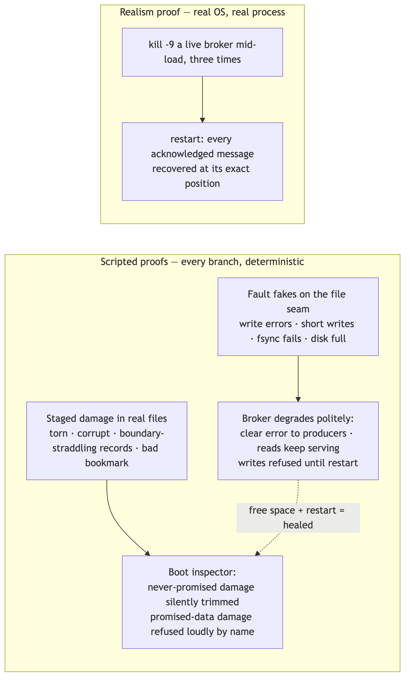
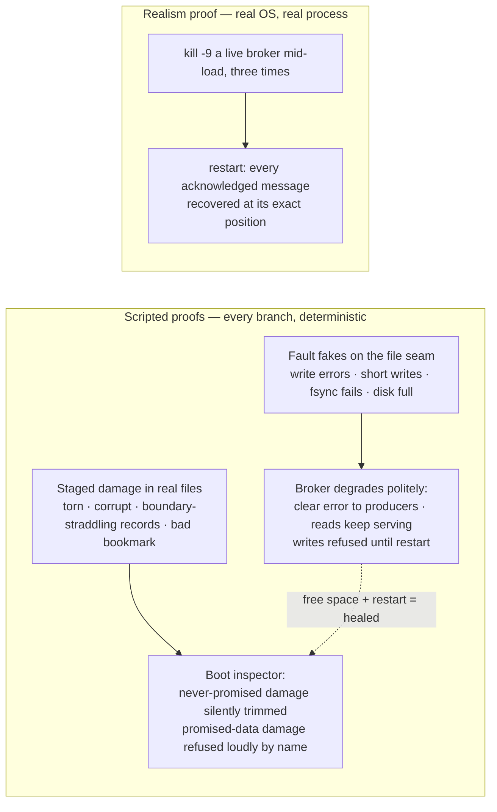

# SL1 BRIEF — Crash & disk hardening · the only file you need to read at this gate

**For: slice SL1, built and verified 2026-07-28, awaiting your verdict.** SL0 built the crash-safety machinery; SL1's job was to *prove* it — the difference between code that looks right and promises with receipts.

## What this slice proved

Diagram source (mermaid — flowchart)

In plain words: every recovery decision (keep, hide, trim, refuse) now has a test that stages genuinely damaged bytes on disk and watches the decision happen; every disk-failure path has a scripted fault driving it; and a harness `kill -9`s a real broker process under load three times over — 44 acknowledged messages journaled across the cycles, and every one re-verified at its exact position after each of the three kills. One small mechanism completed the picture: when a write fails, the broker now also cleans the torn bytes off the end of the log where that's provably safe.

## The choices, by what they mean for you (say nothing = accept)

| Choice | Effect on you |
|---|---|
| Disk full = polite refusal, proven live | A real 10 MB volume was filled: producers got the named error, reads kept serving, freeing space + restart healed everything with zero manual repair — transcript on file |
| Cleanup after a failed write is deliberately cautious | The log is trimmed back only when we're certain the durability bookmark on disk is the old one — the review caught that trimming eagerly could make a healthy restart impossible |
| The fault fakes can't lie | Anything that can be staged as real damaged bytes IS staged for real — fakes only script what real files can't (API failures) |
| The kill-test asserts one direction only | "Every acked message survives" is the promise; *extra* surviving records are legal (a rejected produce whose bytes already landed) — asserting exact equality would be a false alarm generator |

## Questions, answered (spot-check any)

1. **Can an acknowledged message vanish in a crash now?** No — three real `kill -9` cycles under load, every journaled ack recovered at its exact offset; plus the SL0 fsync-watcher still guards the ack ordering. *(docs/receipts/sl1-kill9-run.txt)*
2. **What if damage hits data that WAS promised?** The broker names the damaged partition and refuses to serve it — and when I sabotaged that refusal by hand, the test went red AND a second, deeper guard still caught the damage. Defense in depth, witnessed. *(receipt, "EXIT SABOTAGE")*
3. **What actually happened on the full disk?** Error code 11 with a clear message, sticky until restart; reads served all records throughout; `rm` the filler + restart = healthy. *(docs/receipts/sl1-scenario-j.txt)*
4. **What was the review's best catch?** My draft cleanup rule could trim the log BELOW an already-installed bookmark (the bookmark write can fail *after* it has really landed) — restart would then refuse the partition and demand manual repair, the exact thing the spec forbids. The shipped rule never trims in that case; restart heals either way. *(D-SL1-3)*
5. **The disk-full demo's post-restart produce got offset 4, not 3 — bug?** No — the rejected produce's bytes had already durably landed, so recovery kept them hidden at offset 3; that's the documented duplicate-on-retry class, seen live. *(crash-walk row 2)*
6. **What is still NOT proven?** Power-loss durability (a documented platform limit of fsync on macOS — not provable in software) · group positions surviving crashes (groups don't exist until SL2 — the harness is ready for them) · the harness's child broker isn't race-instrumented (its race coverage comes from the in-process battery).

## How this was checked

Two independent fresh-eyes seats reviewed the slice design (one a different AI family-tier): **9 findings, all integrated** — the bricking cleanup rule above was the worst. The builder receipted red-before-green for every new test file (50 real FAIL lines in the receipt). Then my own hands: full battery re-run green (80 tests, race-checked), the exit sabotage witnessed red and restored, the disk-full demo run live. CI is green on GitHub at this commit.

## Status + what you do now

Read this brief; spot-check any receipt it names. Verdicts: **pass** · **revise: \<feedback\>** · **abandon**. On pass, the next slice is **SL2 — consumer groups**, the headline feature, when you invoke it.
