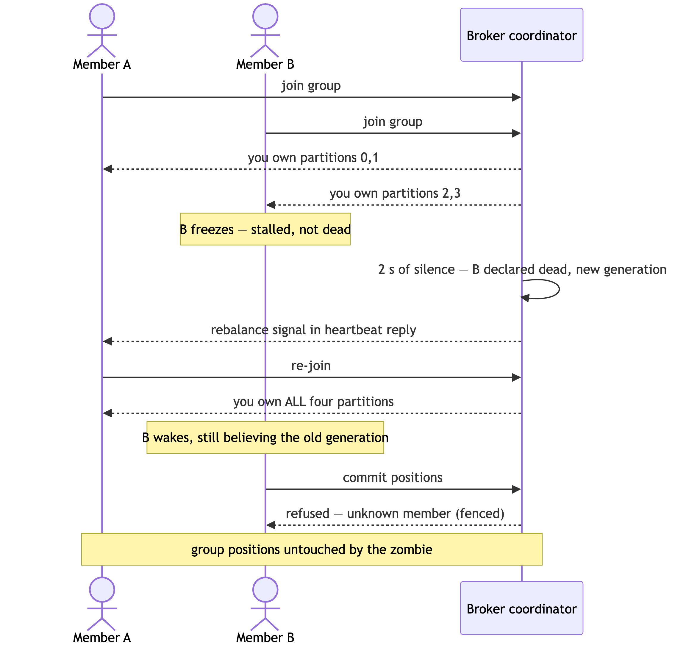
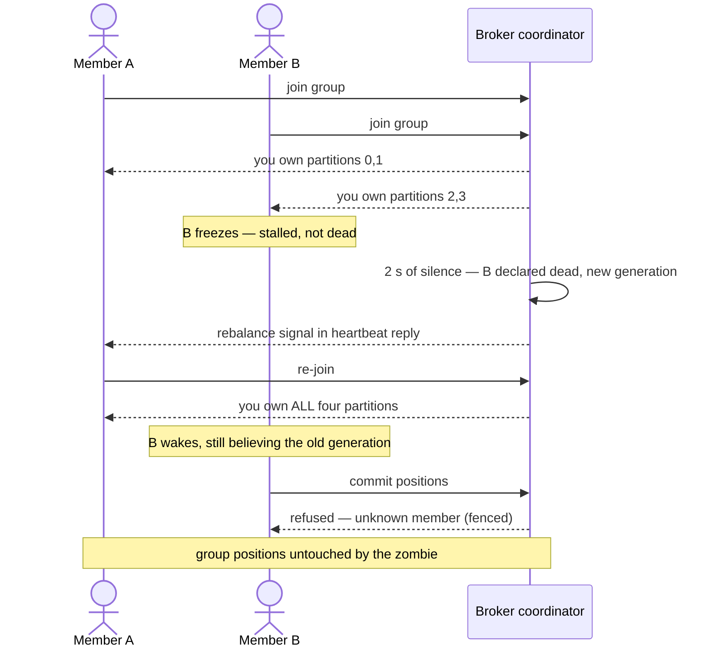

# SL2 BRIEF — Consumer groups · the only file you need to read at this gate

**For: slice SL2, built and verified 2026-07-29, awaiting your verdict.** The headline feature: consumers that share a topic's partitions, heal when one dies, and can never have a half-dead straggler corrupt the group's progress.

## What this slice built, as the demo experiences it

Diagram source (mermaid — sequence diagram)

That exact story ran LIVE on real `mk consume -g` processes — SIGSTOP for the freeze, real 2-second deadline, the survivor's takeover and the zombie's refused commit both visible in the transcript. *(docs/receipts/sl2-scenario-e.txt)*

## The choices, by what they mean for you (say nothing = accept)

| Choice | Effect on you |
|---|---|
| A stalled consumer can't wreck anything | Its identity dies at the 2 s deadline; anything it says afterwards is refused with a stable error code — proven live and in tests |
| Commits are safe under every race the review found | Two members committing at once can't erase each other; a member fenced mid-commit gets no false ack; the group's file is written before every ack (crash-proven in the kill -9 harness) |
| The demo CLI recovers from routine reshuffles | A live member whose commit collides with a rebalance prints the error and rejoins — only a genuinely dead identity exits. This distinction came from the live demo CATCHING a real bug all 128 tests missed |
| Group bookkeeping can't be eaten at boot | The broker's boot cleanup now explicitly protects the commit folder — without that rule, every restart would have deleted all group positions (review catch, then test-pinned) |

## Questions, answered (spot-check any)

1. **Do group positions survive a broker `kill -9`?** Yes — the crash harness now commits while producing, journals every acked commit, and after each of 3 kills the recovered positions were at-or-past every journaled one. *(docs/receipts/sl2-kill9-commits.txt)*
2. **Can messages be lost when a member dies mid-work?** No — a member was killed mid-batch before committing, and the union of what the group processed still equaled everything produced (duplicates allowed, loss fatal — the at-least-once promise, tested by name). *(TestGRP3UnionAcrossMemberCrash)*
3. **What was the review's best catch?** Two, both fatal-in-production: fencing heartbeats would have made the "please rejoin" signal *undeliverable* (and swept live members mid-rebalance), and the commit path could lose acked commits when two members committed concurrently — BOTH seats found the second one independently. *(D-SL2-5/6)*
4. **What did the live demo catch that tests didn't?** The CLI treated a routine rebalance collision as fatal and quit — so two members could never coexist. All 128 tests were green when this happened; the transcript's second run is the red, the third is the green. *(sl2-scenario-e.txt header)*
5. **Why is a rejected produce visible at offset 3 in the disk-full receipt but this slice's zombie commit invisible?** Different guarantees: unacked data may durably exist (and is hidden until covered); a fenced commit changes NOTHING — zero state change is the tested contract. *(GRP-5)*
6. **What is still NOT proven?** The 60-second demo gate (SL3 owns the demo program and its CI clock) · hostile-input completeness for the new group messages (SL4's audit) · the protocol document (SL6). The group feature itself has no deferred halves — both SL2 entries in the open-proofs ledger are closed.

## How this was checked

Design first: 2 independent seats (one a different model), **13 findings, all integrated** — including a rebalance livelock and a goroutine leak that never got the chance to exist. Build: red-before-green receipted for every new test file (natural reds + one-line mechanism sabotages, each restored and re-verified). My own hands: full battery re-run green (**128 tests, race-checked** — up from 80), the serve-time fence sabotaged and witnessed red in two tests, the SD-11 procedure run live three times until every receipt line meant exactly what it said. CI green on GitHub at this commit.

## Status + what you do now

Read this brief; spot-check any receipt. Verdicts: **pass** · **revise: \<feedback\>** · **abandon**. On pass, next is **SL3 — the demo** (2.5d): the two-act `cmd/demo` with narrated takeover, and the 60-second gate measured by an external clock in CI.
