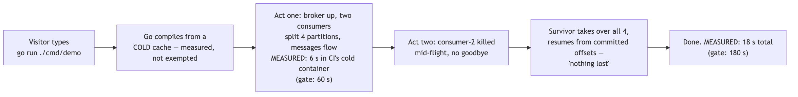
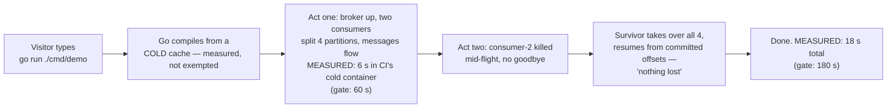

# SL3 BRIEF — The demo · the only file you need to read at this gate

**For: slice SL3, built and verified 2026-07-29, awaiting your verdict.** This is the success-bar slice: your grill answer said the project succeeds when a stranger clones it and sees it work inside 60 seconds — that number is now measured by a clock the demo cannot see, and gated forever in CI.

## What a visitor experiences (with the real measured times)

Diagram source (mermaid — flowchart)

The transcript reads as a story: ownership lines, first records per partition, per-second tallies, then the kill and the takeover — identical every run by construction, so the tests can pin it byte-for-byte. *(docs/receipts/sl3-scenario-a.txt)*

## The choices, by what they mean for you (say nothing = accept)

| Choice | Effect on you |
|---|---|
| The clock is external and includes compile time | The demo cannot flatter itself: CI timestamps its output from outside, cold caches, in a container pinned by digest — the committed receipt IS a real CI run's output |
| The kill is honest | A new client primitive drops connections mid-flight with no goodbye — to the broker it is indistinguishable from a process kill; the polite shutdown path still exists separately |
| The gate checks the story, not just the stopwatch | The timing job also asserts the takeover narration is present in the gated transcript — a regression that garbles act two can't hide behind fast times (a review catch: the gated and tested paths originally never coincided) |
| The public README now tells the truth | Top screen = the one command + what you'll see; the body's stale claims ("no consumer groups yet", "walking skeleton") are corrected NOW rather than riding two more slices |

## Questions, answered (spot-check any)

1. **What are the real numbers?** CI's cold pinned container: first messages at **6 s**, everything done at **18 s** — against gates of 60 and 180. My macOS cold-cache run: 2 s / 18 s. *(docs/receipts/demo-timing.txt, demo-timing-macos.txt)*
2. **Cold cache in 2 seconds — is that measurement broken?** I suspected exactly that and probed it: a verified-cold build of the demo takes 1.85 s on this machine — small stdlib-only module, highly parallel compiler. The script's cache isolation is real; the 60 s budget is headroom for slower machines.
3. **What was the review's best catch?** The demo's headline narration ("consumer-1 now owns partitions 0,1") required a client accessor that didn't exist — the design promised lines the program couldn't print. Second best: the naive kill would have taken a mutex a parked poll holds for up to 7 seconds, turning "SIGKILL" into a polite wait. *(D-SL3-2)*
4. **Can the gate actually fail?** Seen red four ways: scripted late first-flow, scripted late total, a hang (distinct exit via the guard), and my exit sabotage — one character off the marker line, caught with exit 5, restored. A fifth red proves the harness itself can't cheat: a harness that stamps lines late fails a calibrated window assertion. *(receipts)*
5. **One deviation to know about:** the locked design wording says the receipt records the "resolved image digest"; a container can't observe its own digest from inside, so the workflow pins the image BY digest and the receipt echoes that pin — the digest is real, its provenance is the workflow rather than runtime observation. Surfaced here per process hygiene; no behavior differs.
6. **What is still NOT proven?** Benchmarks (SL5 — the README's numbers section still waits) · hostile-input audit (SL4) · the committed timing receipts go stale by design between refreshes — each names the commit it measured.

## How this was checked

2-seat design review (one different-model): **13 findings, all integrated** — including the missing accessor, the mutex trap, and the README contradiction. Builder red-before-green receipted per test file, plus two harness bugs the builder caught in its own gate tests (an orphaned child holding the pipe open; a masked failure exit). My hands: full battery re-run (**131 tests race-checked**, counted by command — the builder's 125 was top-level only), scenario A live, the macOS cold leg with a verified-cold probe, the marker sabotage, and the CI capture. CI green at HEAD, five jobs now — the fifth is this slice's own gate.

## Status + what you do now

Read this brief; spot-check any receipt. Verdicts: **pass** · **revise: \<feedback\>** · **abandon**. On pass, next is **SL4 — hostile inputs & caps audit** (2d): every input cap proven with a rejection test, the error registry audited complete, idle-connection reclaim.
