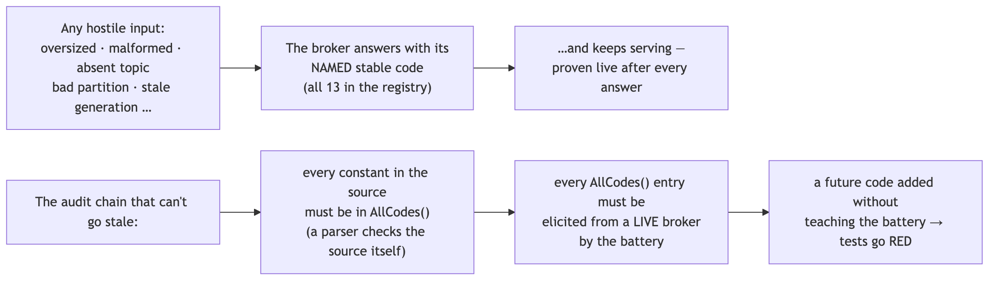
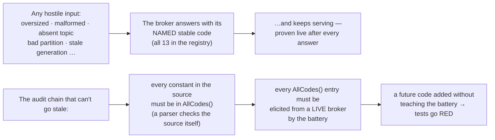

# SL4 BRIEF — Hostile inputs & caps audit · the only file you need to read at this gate

**For: slice SL4, built and verified 2026-07-29, awaiting your verdict.** This is the completeness slice: every way a stranger's bytes can be hostile now has a named, tested answer — and the answering machinery is audited so it can't silently rot.

## What the slice built

Diagram source (mermaid — flowchart)

Two behaviors changed at the edge (both were promised in the locked design and marked "SL4's" in the code since SL0): a 257th connection now gets told "connection cap reached" before the door closes (it used to be slammed silently), and a connection that goes silent for 5 minutes is reclaimed so leaked connections can't clog the cap.

## The choices, by what they mean for you (say nothing = accept)

| Choice | Effect on you |
|---|---|
| The completeness audit is a test, not a checklist | Anyone (future slices included) adding an error code without a live proof breaks the build — the registry can't drift from reality between now and the SL6 protocol doc |
| Idle reclaim never bites a healthy client | Heartbeats keep group members exempt by arithmetic; a paused app keeps its membership and quietly redials its data connection (a review catch: without that client fix, pausing >5 min would have hard-failed) |
| Sleeping clients of the simple APIs must redial | The plain Producer/Consumer do NOT auto-reconnect after reclaim — their docs now say so honestly instead of the draft's false "clients reconnect" claim |
| The battery IS scenario H | The exit demo and the permanent test are the same script — the receipt you can read is re-proven on every future `go test` |

## Questions, answered (spot-check any)

1. **What are the numbers?** 143 race-checked tests (counted by command; 119 before the slice), 13/13 registry codes elicited live, 12/12 input caps each with a named rejection test, 14 review findings all integrated. *(docs/receipts/sl4-scenario-h.txt, sl4-red-green.txt)*
2. **What was the review's best catch?** The "audit that cannot go stale" as drafted audited the list against itself — a forgotten constant would pass silently. Now a parser reads the constants from source and the chain source → list → live elicitation breaks loudly at any gap. *(D-SL4-1)*
3. **Did the independent verification catch anything real?** Yes — the builder's shutdown-code test passed 30 isolated runs, then failed 20-of-20 attempts under full-suite load on my re-run: a timing race, not a broken broker. Fixed by scripting the shutdown window open through the storage seam and collecting on a second connection; it now sees ~8,000 shutdown frames where it saw zero. *(receipt, "INTEGRATOR VERIFICATION" section)*
4. **Can the gate actually fail?** Seen red: every new test against the seams-only broker · the battery with one elicitation deleted (the union check names the missing code) · the stalled-reader test with the write deadline removed · my exit sabotage — payload cap weakened → battery AND the per-cap test red, restored, green. *(sl4-red-green.txt)*
5. **Why is there no clock object for the idle timer, when the locked plan said "clock seam"?** Network deadlines run on the operating system's wall clock — an injected fake clock cannot drive them. The seam is a configurable duration instead (tests use 200 ms). Same intent, different mechanism; flagged here rather than silently absorbed.
6. **Anything else off-plan to know about?** Two paper-trail items: the registry has 13 codes where the locked design's list named 12 (the 13th is SL0's shutdown code, added under the growth rule) · the locked slice list cites decision "SD-10" where it means "SD-8" (a misnumber; SD-10 is about publication). And one client behavior change beyond the two edge changes: the group consumer's redial now also triggers on a reclaimed connection (the review's landmine catch, choice table row 2).
7. **What is still NOT proven?** Benchmarks (SL5) · the protocol document + its CI diff against this registry (SL6 — AllCodes() was built as its hook) · in-flight-per-connection has no rejection test because there's nothing to reject (the serve loop is one-request-at-a-time by construction).

## How this was checked

2-seat design review (one different-model): **14 findings, all integrated** — including the self-auditing-list hole, the false client-reconnect claim, and both seats independently catching that the shutdown code can't be elicited from a broker that must stay alive. Builder red-before-green receipted per test file. My hands: full battery re-run fresh (**143 tests race-checked, 0 fail, three consecutive full-suite runs**), the flake catch + fix in Q3, scenario H captured live, the exit sabotage, code map 122/122 anchors + completeness pass. CI: green at push (checked below the line — five jobs).

## Status + what you do now

Read this brief; spot-check any receipt. Verdicts: **pass** · **revise: \<feedback\>** · **abandon**. On pass, next is **SL5 — benchmarks** (2d): the closed-loop harness with honesty labels, real percentiles, and the README numbers section generated from a committed report.
