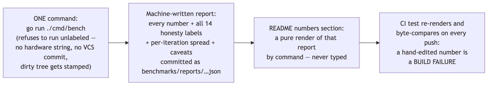
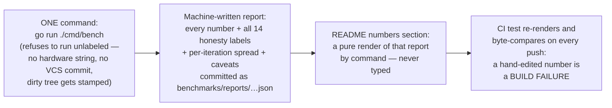

# SL5 BRIEF — Benchmarks · the only file you need to read at this gate

**For: slice SL5, built and verified 2026-07-30, awaiting your verdict.** This is success bar G2b: the project now has numbers — honest, labeled, reproducible — and machinery that makes dishonest numbers a build failure rather than a code-review hope.

## The honesty chain the slice built

Diagram source (mermaid — flowchart)

## The reference numbers (this machine: Apple M3 Max, 128 GB, macOS 26.5.2)

Roughly **40–100 messages/s** with ack latency **p50 ≈ 70–140 ms**, and one iteration carrying a **3.7-second** p99 stall — printed in the README exactly as measured, spread and all. These look modest because they are maximally honest: the probe below showed durability on macOS is *stronger* than the docs assumed, and every message waits on real full-disk barriers.

## The choices, by what they mean for you (say nothing = accept)

| Choice | Effect on you |
|---|---|
| The README table carries its warts inline | Error and duplicate counts sit beside every throughput number; the spread block shows the 3.7 s outlier rather than averaging it away; "no capacity claims" is a printed caveat |
| CI never runs the benchmark | A shared cloud runner would launder false hardware labels into the repo — CI only enforces README↔report consistency; fresh numbers require a human on real, named hardware |
| A benchmark that can't be traced won't run | No hardware string → refusal. No commit in the binary → refusal naming the fix. Modified working tree → the report is stamped "-dirty" and the gate refuses to accept it as the reference |
| The bench aborts rather than measure garbage | If its consumer gets swept mid-run (machine overload), the run dies loudly instead of shipping numbers with an invisible rebalance inside |

## Questions, answered (spot-check any)

1. **Why are the numbers so low?** I probed it: Go's file-sync call on macOS issues **F_FULLFSYNC** — a full drive-cache barrier costing ~5.5 ms (raw fsync is 0.1 ms) — and every flush pays three of them, with four partitions' barriers serializing at the device. Roughly 110 ms per durable ack is this machine telling the truth about real durability. *(probe transcript in docs/receipts/sl5-scenario-g.txt)*
2. **Doesn't that contradict the locked design?** Yes — usefully. The locked design's caveat says macOS fsync "may not flush the drive cache"; for Go code the direction is **inverted** (Go chose the stronger barrier, so macOS is safer and slower). The report and README now state the corrected reality; the locked wording is your gate call: accept as a surfaced deviation like prior slices, or spin a formal erratum for the design document (the README/protocol doc pass at the next slice would carry it either way).
3. **What was the review's best catch?** The reference run as originally commanded (`go run`) embeds no version-control info — the report's commit label would have been **empty**, breaking traceability at the exit demo itself, while the test suite (which builds a binary) stayed green. The harness now refuses to emit an untraceable report. *(D-SL5-8)*
4. **Did the gate actually catch anything live?** Twice, on me: my first reference build got stamped `-dirty` (an untracked receipt file was present at build time) and would have been rejected as the reference; and my hand-edit of one README digit went red in the byte-compare and was restored by re-render. *(receipts)*
5. **Anything flaky?** One real thing, caught the same way as last slice — by my full-suite re-run, not the builder's isolated runs: under full-suite load the smoke test's consumer can get heartbeat-starved past the 2-second session window, and the bench (correctly) aborts. The smoke now retries once, loudly, on exactly that abort; a second sweep stays red. Six consecutive full-suite runs green, one exercising the retry live. *(docs/receipts/sl5-red-green.txt)*
6. **What are the totals?** 152 race-checked tests by command (143 before the slice), 16 review findings all integrated (three convergences), 14 labels on every published number, zero errors and zero duplicates in the reference run. 
7. **What is still NOT proven?** The protocol document and its registry-diff CI check (next slice — the doc-audit half is the only remaining open partial proof) · benchmark numbers on Linux (the reference is macOS; the report's platform labels make that explicit) · report freshness between refreshes (each names its commit; the gate pins consistency, not recency).

## How this was checked

2-seat design review (one different-model): **16 findings, all integrated** — the empty-commit trap, the README block that would have carried only 6 of 14 labels, the unlabeled 5 ms batching window (both seats independently), the smoke assertion that would have failed on healthy zero counts. Builder red-before-green receipted per file, gate leg ending its phase in a named skip. My hands: fresh full-suite runs (**152 race-checked, six consecutive greens**), the F_FULLFSYNC probe, the reference run + README render, both live gate catches, the exit sabotage, code map 130/130 + completeness pass. CI green at push — five jobs, the render gate riding the test job, now armed.

## Status + what you do now

Read this brief; spot-check any receipt or the README's new section. Verdicts: **pass** · **revise: \<feedback\>** · **abandon**. Also per Q2: say whether the fsync-direction correction rides as a surfaced deviation or you want a formal design erratum. On pass, next is **SL6 — protocol doc & repo completion** (2.5d): PROTOCOL.md a stranger could implement from, the registry-diff CI check consuming SL4's AllCodes hook, the doc-audit half of the last open partial proof, and the full README pass.
