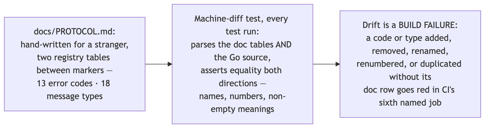
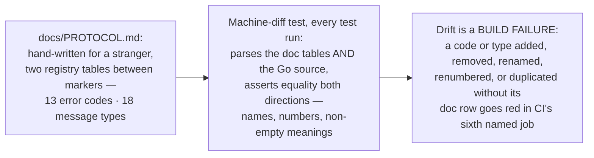

# SL6 BRIEF — Protocol doc & repo completion · the only file you need to read at this gate

**For: slice SL6, built and verified 2026-07-31, awaiting your verdict.** This is scenario K — the repo-completion bar (a push to the public repo runs the whole check battery green): the project now carries a wire-protocol document a stranger could implement a client from, the doc's two registry tables are machine-diffed against the code on every run, and the README no longer contradicts itself in public.

## The honesty chain the slice built

Diagram source (mermaid — flowchart)

## What else the slice fixed

The README truth pass: the public self-contradiction about durability (fsync) is gone — the old inverted claim ("may not flush the drive cache") is replaced by the corrected sentence, verbatim from the benchmark's single wording authority, so there is exactly one wording to keep true. The README now also states delivery honestly (at-least-once: duplicates possible after crashes, loss is not) and warns that pointing the broker's address flag off localhost exposes an unauthenticated protocol to that network.

And the doc-audit half of the last open "partial proof" — showing the documented message set contains no partition-resize operation — is closed as a standing, machine-checked property: every partially-proven item from the spec's tracking list is now fully done, and STATUS says so.

## The choices, by what they mean for you (say nothing = accept)

| Choice | Effect on you |
|---|---|
| CI's build-and-smoke job now runs on BOTH Linux and macOS | A surfaced deviation candidate: the locked audit demanded both platforms but CI only did macOS — the matrix fix is an audit-driven CI change put in front of you, not silently absorbed |
| The package-documentation audit's command was corrected mid-build | The pinned check was wrong twice (the draft's proved nothing; the review's replacement broke on Go's convention for command packages) — the shipped form asks Go's own toolchain, every package IS documented, full trail receipted |
| The doc lists 13 error codes where the locked design's prose says 12, and the group-aware fetch message (GroupFetch) differs in shape from the design's sketch | Both are references to deviations you ALREADY accepted at the SL4 and SL2 gates — nothing new to decide |
| CLI polish declined as out of scope | No command-line code changed this slice; anything you want there becomes a named post-v1 item, not silent scope creep |

## Questions, answered (spot-check any)

1. **Could a stranger really implement from the doc alone?** The independent verifier's cold read says YES for a client from the file alone, and YES for a broker with two small gaps — both fixed the same day (produce error order · how no-wait is encoded · fetches don't count as liveness · the exact partition split). *(docs/receipts/sl6-red-green.txt)*
2. **What was the review's best catch?** Without the now-written rule that a client's read timeout must exceed the wait it requests, a stranger's long-poll client would have died on every empty poll — the broker legally stays silent for the full wait before answering. *(slices/SL6/DESIGN.md §7)*
3. **Did review catch CI itself?** Yes — the CI audit claimed only one job lacked the runner-version echo line when two did, and both jobs now print their resolved runner image into every run's log. *(slices/SL6/DESIGN.md §7 · .github/workflows/ci.yml)*
4. **What is the audit-correction story in the choices table?** Three layers each caught the previous one's defect — the draft's package-doc command was vacuous, the review seat's replacement was itself convention-wrong, and the builder STOPPED red rather than work around it, so the integrator corrected the check to a wording-agnostic form with the whole trail receipted. *(docs/receipts/sl6-audits.txt)*
5. **Was the diff gate exercised, not just written?** The verifier corrupted the doc six different ways (deleted row · fictitious resize row · renumbered type · blanked meaning cell · stray prose inside a table · duplicated row) and watched each go red with a named reason then green on restore — and the integrator re-ran the fictitious-row sabotage bare at exit, red then green. *(docs/receipts/sl6-red-green.txt)*
6. **The tables are machine-proven — what about the prose around them?** The verifier checked nine of the doc's behavioral claims directly against the code and found zero contradictions; prose truth stays human-checked (an accepted, stated gap) while the lists themselves cannot lie. *(docs/receipts/sl6-red-green.txt, verifier section)*
7. **What are the totals?** 147 test functions by command (146 before the slice — the only new Go file is the diff test itself), full suite race-green, checks.sh ALL CHECKS GREEN, redaction sweep 0 matches, zero production code changed. *(docs/receipts/sl6-red-green.txt · sl6-audits.txt)*
8. **What is still NOT proven?** Nothing from the spec's partial-proof tracking list any more — what remains is only the standing residue: prose outside the two diffed tables, and README text outside the benchmark markers, stay human-maintained. *(STATUS.md)*

## How this was checked

2-seat design review (one different-model): **19 findings, 2 independent convergences, all integrated** — the read-timeout rule, the undercounted echo lines, a table grammar pinned so strictly that stray prose is a test failure. Builder: red-before-green receipted (doc absent → red · tables incomplete → red with counts named), plus the honest STOP on the wrong audit command. Independent verifier — not the builder: three consecutive full-suite race runs green, all six sabotage rows red/restored/green under its own hands, nine prose-vs-code checks clean, the cold read above. Integrator: every gate re-run bare, own exit sabotage, audits receipted, code map regenerated; the exit push ran ALL six named CI jobs green on the public repo — seven check runs, build-smoke on both Linux and macOS for the first time (run receipt in docs/receipts/sl6-audits.txt).

## Status + what you do now

Read this brief; spot-check any receipt, or open docs/PROTOCOL.md and try to poke a hole in it. Verdicts: **pass** · **revise: \<feedback\>** · **abandon** — the choices table above is the whole gate list, and saying nothing accepts all four. On pass, next is **SL7 — the showcase build (conditional, 3d)**: the watch-only live page or its documented honest absence, with its kill criterion re-armed at the account-creation moment (a demanded card = stop and ship the documented "later").
