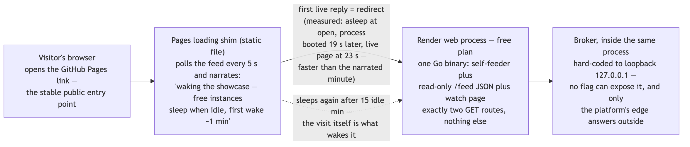
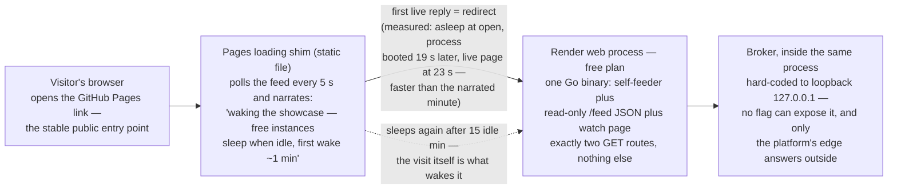

# SL7 BRIEF — Showcase build · the only file you need to read at this gate

**For: slice SL7, built 2026-07-31, deployed and verified live 2026-08-01, awaiting your verdict.** This is scenario I — the live-showcase demo — and the BUILD ending fired, not the documented "later": a visitor opens the GitHub Pages link, watches an honest "waking" narration while the free instance boots, and is swapped into a real watch-only page where this project's broker is visibly driving itself.

## The live path a visitor takes

Diagram source (mermaid — flowchart)

## What else the slice guarantees

Watch-only is enforced in layers, not promised: the broker's loopback address is a hard-coded literal a unit test pins (a saboteur flipped it and watched the test fail), the web surface is exactly two read-only routes — anything else answers "method not allowed" or "not found", both witnessed on the LIVE deployment, not just locally — no visitor input of any kind reaches the broker, and the data handoff between the feeder and the web handlers is race-proven, because without it a burst of visitors could have crashed the whole process.

The $0 story is honest end to end: the free plan is asserted in the committed deploy config, deploys are manual-only so a push never silently spends build minutes, the sleep is narrated on-screen as a feature of free hosting rather than hidden, and the README names RAM — not disk — as the real long-run bound, observable live in the feed's own memory number and self-healing on every sleep or restart.

## The choices, by what they mean for you (say nothing = accept)

| Choice | Effect on you |
|---|---|
| The locked design's "verify the real disk allowance" step was downgraded, loudly | Free instances have no shell, so the allowance is unverifiable — what ships instead is the tested crash-proof path (a full disk becomes the named refusal and a visible pause, never a crash); this is a surfaced deviation for you to accept, recorded as known gap G-SL7-8 in the slice design |
| The port scan's expected output was corrected to the platform's witnessed reality | The draft guessed port 8080 would read closed; live, Render's shared edge answers 8080 on EVERY hostname with its own static "Blocked" page — not our container — so the committed expectation now records what was actually witnessed, investigation in the receipt |
| The scan script gained a connection timeout mid-live-procedure | A committed script was changed during the live run (Render's edge silently drops packets, so probes hung for minutes — something the local self-test could never see); the fix is receipted and all three self-test legs were re-proven before the final scan |
| The README's teardown criterion is now LIVE POLICY | If the platform ever demands a card, starts charging, or the free hours run out, the service is deleted and the public link reverts to "not currently hosted" — you own that trigger from now on |

## Questions, answered (spot-check any)

1. **Was the cold start real, or staged?** Real: the service sat untouched for 25 minutes (past the 15-minute sleep threshold), and the feed's own start timestamp shows the process booting 19 seconds AFTER the page was opened — the visit itself woke a genuinely sleeping instance, and the swap into the live page came about 13 seconds after the waking narration appeared, faster than the narrated "about a minute" and recorded as measured. *(docs/receipts/sl7-scenario-i.txt)*
2. **Is traffic actually flowing up there?** Two raw feed reads 40 seconds apart show the produced counter at 69 then 150 — strictly increasing at the designed ~2 messages per second — with disk usage under 2 KB against the 200 MB cap. *(docs/receipts/sl7-scenario-i.txt)*
3. **Could a visitor write to it, or knock it over?** No: beyond the loopback and two-GET-route layers above, the review's biggest catch was the snapshot handoff — the independent verifier removed its synchronization and the race detector fired 28 warnings on a test that models a visitor flood, proving the shipped code closes a crash that would have taken the broker down with it. *(docs/receipts/sl7-red-green.txt)*
4. **Did the port scan earn its keep?** Twice, live: first its own probe hung against the platform's packet-dropping edge (timeout added, self-test re-proven — the choices table's mid-procedure fix), then the corrected scan flagged port 8080 open and the investigation pinned it on Render's shared edge, not this service — and the same receipt carries live proof the deployed binary answers 405 to a write attempt and 404 to an unknown path. *(docs/receipts/sl7-portscan.txt)*
5. **OPEN — the one thing missing at this gate:** your checkpoint reply was the hostname alone, so the explicit dated "no card was demanded anywhere" attestation is still outstanding — please include that sentence with your verdict, or, if a card WAS shown at any step, say so instead, because that changes the disposition of the $0 check (SHOW-2). *(docs/receipts/sl7-deploy.md)*
6. **What is honestly NOT proven?** The platform's real disk allowance (choices row 1, the surfaced downgrade), and "no card" is inherently point-in-time — the teardown criterion is the standing answer if terms ever change. *(slices/SL7/DESIGN.md §4)*
7. **What are the totals?** 163 test functions by command (147 before this slice), full suite race-green, ZERO production code changed, ZERO CI changes — the public repo's check-run count stays at 7 — and the identity-scrub battery reads zero for every pattern. *(docs/receipts/sl7-red-green.txt)*
8. **Is the receipt trail honest about itself?** Yes: the scrub battery's one alarm was dissected in the open (an unanchored pattern matching three letters inside the ordinary word "teardown" — the word-boundary re-run reads zero, both runs receipted), and an annotation records that one builder red predates a test revision, with the current test independently seen red in the verifier's sabotage. *(docs/receipts/sl7-red-green.txt)*

## How this was checked

2-seat design review (one different-model): **16 findings, 1 partial convergence, all integrated, none declined** — headline: the visitor-flood crash of question 3, now a pinned atomic-handoff contract with its own sabotage row. Builder: six red runs receipted, one per new test file, before any green. Independent verifier — not the builder: all four planned sabotages mutated → red → restored → green under its own hands, including the 28 race warnings. Integrator: every gate re-run bare (own sabotage, the full 12-package race suite, the scrub battery with its correction), the whole live procedure (scan, probes, the cold-start watch), and the commit history shows Phase A pushed CI-green BEFORE any account existed — the designed human checkpoint is visible in the log. *(docs/receipts/sl7-red-green.txt)*

## Status + what you do now

Read this brief; open the Pages link yourself if you want the demo first-hand — a slept instance will replay the whole waking story for you. Verdicts: **pass** · **revise: \<feedback\>** · **abandon** — the choices table above is the whole gate list and saying nothing accepts all four, but ONE reply is needed regardless of verdict: the dated no-card attestation from question 5 (or its correction). On pass, there is no next slice to start: SL7 is the eighth and final row of the locked slice plan (numbered SL0 through SL7), every scenario A–K has now been demonstrated and gated, and mini-kafka v1 is complete.
